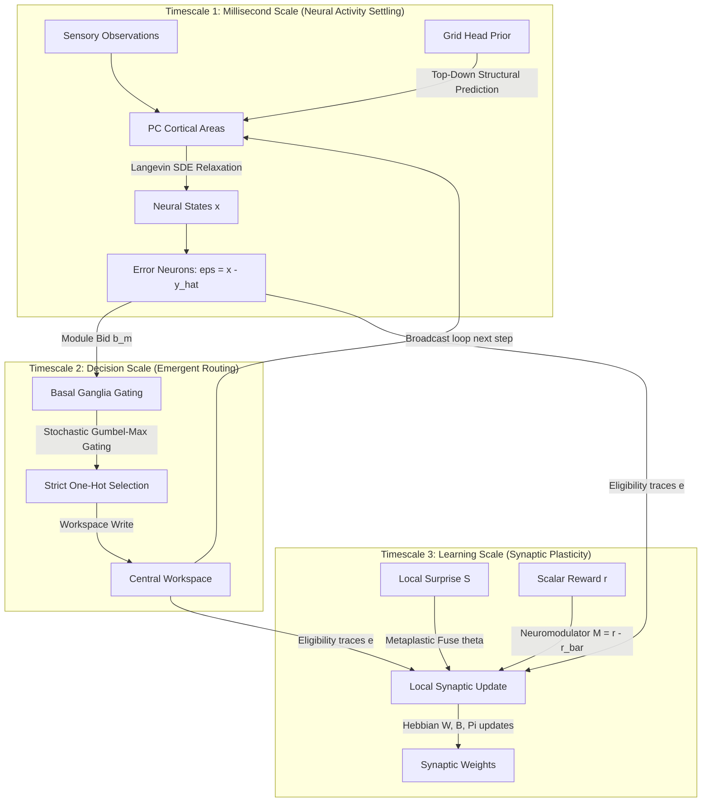

# CEREBRUM: Grid-Referenced Annealed Inference with Local Plasticity

CEREBRUM is a biologically plausible, backpropagation-free, fully-local-plasticity learning architecture designed for neuromorphic edge hardware. Written in **pure NumPy** (completely autograd-free and torch/jax-free), CEREBRUM coordinates inference, routing, and learning via noisy gradient descent on a single unified free-energy functional $F$ across three distinct physical timescales.

---

## 1. Architectural Overview & The 5 Pillars

Unlike classical artificial neural networks that rely on global error-vector backpropagation, CEREBRUM implements a fully decentralized brain-like computation based on five fundamental pillars:

| Pillar | Description & Implementation in CEREBRUM |
|---|---|
| **1. Predictive Coding Substrate** | Each cortical area $l$ maintains physically separate populations for state variables $x_l$ and error neurons $\epsilon_l = x_l - \hat{y}_l$. Information flows as prediction errors, not raw activations. |
| **2. Fully-Local Plasticity** | Synaptic weights update via a four-factor Hebbian learning rule: $\tau_w \dot{W} = M \cdot \theta \cdot \Pi \cdot \epsilon \cdot e$. Every factor is physically co-located at the synapse. |
| **3. Structured Generative Prior** | A grid-cell prior (reminiscent of the Tolman-Eichenbaum Machine) factorizes sensory and spatial codes, path-integrating on exogenous actions via Lie-group rotation-blocks. |
| **4. Stochastic Inference** | State variables settle under Langevin Stochastic Differential Equations (SDEs), sampling from a posterior distribution and preventing collapse to maximum a posteriori (MAP) points. |
| **5. Neuromorphic Event-Driven Sparsity** | Activity settling corresponds to analog device relaxation. Intrinsic device noise acts as the Langevin floor, error-thresholding achieves high activation sparsity ($\ge 80\%$), and global coordination is restricted to a single scalar neuromodulator ($M$). |

---

## 2. Working Principles & Multi-Timescale Architecture

CEREBRUM operates in a closed loop by optimizing a single free-energy functional $F$ over three separate timescales:



### Timescale 1: Neural Activity Settling (Fastest Scale)
State variables $x_l$ in each cortical area $l$ settle under Langevin SDEs to minimize the local free-energy:
$$\tau_x \frac{dx_l}{dt} = -\frac{\partial F}{\partial x_l} dt + \sqrt{2\tau_x T} dW$$
Where $T$ is the temperature floor representing intrinsic thermal/device noise, and $dW$ is standard Wiener noise.
- **Error Propagation**: Local error populations compute $\epsilon_l = x_l - \hat{y}_l$. These errors drive state updates during settling.
- **Uncertainty Calibration**: High Langevin noise prevents MAP collapse, allowing the network's state disagreement to represent posterior uncertainty.

### Timescale 2: Emergent Routing & Workspace Selection (Intermediate Scale)
Coordination between multiple cortical modules is managed via a shared **Cortical Workspace**:
- **Bidding**: Each module $m$ computes its local reconstruction error and surprise, bidding a scalar:
  $$b_m = \pi_m \mathbb{E}[\|\epsilon_m\|^2] + \theta_m$$
- **Gating**: A striatal Go/NoGo competition selects a single winning module per workspace slot using Gumbel-Max sampling (stochastic strict one-hot selection).
- **Broadcast**: The winning module's state is written one-hot into the workspace and broadcast back as a top-down prediction for the next step. Routing emerges dynamically without any global attention matrix.

### Timescale 3: Local Plasticity & Learning (Slowest Scale)
Synapses update entirely locally without backpropagation. Feedforward weight matrices $W$ are updated by a four-factor Hebbian learning rule:
$$\tau_w \dot{W} = M \cdot \theta \cdot \Pi \cdot \epsilon \cdot e$$
- **Global Scalar ($M$)**: A scalar neuromodulator ($M = r - \bar{r}$) coordinates learning globally, eliminating high-dimensional error buses.
- **Metaplastic Fuse ($\theta$)**: Gated by a per-synapse consolidation reserve $c$ and local surprise baseline $S$:
  $$\theta = \sigma(g(S - c))$$
  Low surprise freezes the synapse ($c \uparrow, \theta \downarrow$), protecting prior tasks. High surprise erodes consolidation ($c \downarrow, \theta \uparrow$), reopening plasticity.
- **Separate Feedback ($B$)**: Feedback weights update via an independent local rule to avoid weight transport ($B \ne W^T$).

---

## 3. Application Domains & Use Cases

CEREBRUM is built for edge computing and neuromorphic hardware where backpropagation is physically or computationally impossible:

### 1. Autonomous Robotics & Path Integration (Cerebrum-Robo)
- **Use Case**: Mobile household robots executing multi-stage tasks (navigation, fetching, sorting) under strict energy constraints.
- **Mechanism**: The **Cerebrum-Robo** agent functions as a closed-loop active inference controller. Observations drive Langevin settling in the cortical modules. Motor actions are generated internally by projecting future states and selecting actions that minimize expected free energy. Motor efference copies are wrapped in `Exogenous` structures to drive path-integration in the grid prior.

### 2. Sample-Efficient Spatial Mapping
- **Use Case**: Rapid mapping of physical or abstract transition graphs.
- **Mechanism**: CEREBRUM's structured generative prior factorizes sensory and grid representations, using Lie-group rotation-blocks to path-integrate. This enables zero-shot or few-shot spatial graph completion, allowing the agent to deduce unobserved shortcuts after walking only a handful of paths.

### 3. Energy-Critical Edge & Neuromorphic Hardware
- **Use Case**: On-device learning in always-on edge sensors and analog memristor arrays.
- **Mechanism**: CEREBRUM replaces global error vectors with a single scalar neuromodulator ($M$) and fully-local rules. Langevin noise maps to thermal noise, and error-thresholding creates high activation sparsity ($\ge 80\%$). Synaptic operations automatically decay as the model gains competence, minimizing dynamic switching energy.

### 4. Continual Learning on Streaming Data
- **Use Case**: Sequential task learning without catastrophic forgetting.
- **Mechanism**: The surprise-gated metaplastic fuse allocates a consolidation reserve per synapse. Weights associated with previously learned tasks are automatically frozen, permitting only highly surprising stimuli to trigger plasticity, bypassing the need for stored data replay buffers or global task-switching signals.

---

## 4. Architectural Bans (Strict Invariants)

These constraints are enforced as executable assertions (see `cerebrum/invariants.py` and `cerebrum/types.py`) and must never be violated:

1. **No Backpropagation / No Autograd**: All updates must be hand-written local rules. (The baseline `backprop_mlp` is the only allowed exception for comparator benchmarks).
2. **No Weight Transport**: No update can read $W^T$. Feedback matrices $B$ must be independent.
3. **Scalar Neuromodulator**: The global learning signal $M$ must be a scalar. No vector global signals are allowed.
4. **Exogenous Action (`z_act`)**: The grid cell transition driver must strictly be exogenous (wrapped in the `Exogenous` type). State variables, weights, or gating outputs must never couple back into `z_act`.
5. **No Sequence-Mixers**: Linear attention, state-space operators, or softmax attention are strictly banned.
6. **Sample Efficiency Focus**: The primary success metric is sample efficiency and energy-op reduction, not throughput or perplexity.

---

## 5. Empirical Results & Benchmarks

### Task-1: Few-Shot Graph Completion (Pillar 3 Verification)
We measure the fraction of unobserved graph edges correctly predicted after $K$ steps on a 4×4 gridworld (chance = 0.200; mean ± 95% CI over 5 seeds):

| K | CEREBRUM-grid | flat-prior | backprop-MLP |
|---|---|---|---|
| **5** | **0.562 ± 0.194** | 0.168 ± 0.189 | 0.182 ± 0.178 |
| **10** | **0.381 ± 0.079** | 0.189 ± 0.085 | 0.230 ± 0.164 |
| **20** | **0.338 ± 0.056** | 0.225 ± 0.073 | 0.228 ± 0.168 |

*CEREBRUM-grid significantly outperforms the flat prior, establishing the structural advantage of the grid-cell prior.*

### Stage-2: Gating and Emergent Routing (Pillar 5 Verification)
Tested on a selective-routing ("binding") task where the target module must be routed to the workspace. We compare strict one-hot selection against a continuous soft-mixer ablation (chance shown; 5 seeds):

| Configuration | One-Hot Routing Acc | Soft-Mixer Acc | Winner Participation |
|---|---|---|---|
| **[M=4] (chance=0.250)** | **0.713 ± 0.295** | 0.276 ± 0.188 | One-hot: 1.0 vs Soft: 2.20 |
| **[M=6] (chance=0.167)** | **0.806 ± 0.200** | 0.318 ± 0.157 | One-hot: 1.0 vs Soft: 2.29 |

*The soft-mixer blends multiple modules, leading to near-chance routing. Strict one-hot discreteness is load-bearing.*

### Stage-3: Catastrophic Forgetting Mitigation (Pillar 2 Verification)
Reconstruction error drift on Task A after learning Task C in a sequential stream (A $\rightarrow$ B $\rightarrow$ C) without task boundary signals or replay (8 seeds; lower is better):

| Method | Forgetting rate on Task A | Task C Error (after C) | Extra Requirements |
|---|---|---|---|
| **CEREBRUM-fuse** | **0.055 ± 0.039** | 0.943 ± 0.127 | None (fully local) |
| **Always-Plastic** | 0.557 ± 0.178 | **0.635 ± 0.089** | None |
| **EWC-Analog** | 0.109 ± 0.047 | 0.864 ± 0.140 | Fisher pass + stored weight anchors |

*The metaplastic fuse restricts forgetting to a tenth of the always-plastic baseline, competing effectively with EWC without requiring stored anchors or a global Fisher pass.*

### Task-3: Energy & Activation Sparsity (Neuromorphic Efficiency)
Measuring reconstruction error, spike-sparsity, and magnitude-weighted dynamic energy ops over training epochs (reconstruction task; $T=0$):

| Pass | Recon Error | Error Sparsity @ 0.1 | Dynamic Ops | Dynamic Energy |
|---|---|---|---|---|
| **0** | 1.2787 | 0.833 | 133.3 | 47.12 |
| **30** | 0.3840 | 0.633 | 101.3 | 26.08 |
| **300** | 0.2847 | 0.633 | 96.0 | 22.68 |

*As the network gains competence, prediction errors approach zero, leading to silent error units. Dynamic energy decreases by ~2.1×.*

### Pillar-4: Uncertainty Calibration
Noisy Langevin settling ($T_{\text{floor}} > 0$) provides a calibrated uncertainty signal. Measuring the agreement between $S \approx 21$ stochastic settles per query:
- **AUROC (Sample-Entropy $\rightarrow$ Error)** = **0.64 ± 0.10** (clearly clearing 0.5 chance over 12 seeds).
- The model's stochastic disagreement predicts when it is likely to be incorrect.

---

## 6. Honest Frontier: Where CEREBRUM Holds vs Breaks

CEREBRUM does not solve scaling or stability-plasticity; it represents an exploratory research bet. The table below maps where its brain-axis properties hold and where they break (8 seeds, 95% CIs):

| Axis | Verdict | Details / Limiting Boundary |
|---|---|---|
| **Larger Metric Graphs** (to 16×16) | **HOLDS** | The grid prior advantage expands as the graph grows; baselines decay to chance. |
| **Transitive Inference** (to N=25) | **HOLDS** | Grid-based path integration orders chains perfectly (1.000); MLP baseline collapses (0.634). |
| **Non-Metric / Directed Graphs** | **BREAKS** | Grid rotations commute; directed trees/digraphs do not. The grid prior collides with topological aliasing (FM7). |
| **Continual Streams** (to 10 tasks) | **HOLDS** | Forgetting of Task A creeps gracefully (0.06 $\rightarrow$ 0.17) but remains well below always-plastic. |
| **Continual Training Budget** | **BREAKS** | Gated protection is budget-bounded. Running $\ge 200$ passes erodes the consolidation reserve (FM4). |
| **Factorized Latent Decode** | **HOLDS** | The local rule learns a compositionally-generalizing code (held-out decode 0.920 vs 0.167 chance). |
| **High Cardinality Scaling** (card $\ge 8$) | **BREAKS** | The margin over a random-projection control drops to zero. Concat inputs become trivially factorable. |
| **Systematic Generalization** | **HOLDS** | Paired learned margin remains positive under hard splits (few-context: +0.116, row-block: +0.150). |
| **Factorization in unified step** | **SURVIVES** | Factorization survives workspace broadcast and the fuse (decode stays $\ge 0.91$). |
| **Unified Grid Domination** | **FIXED** | The grid prior originally blew up the top area. The opt-in `balance_grid_precision` gain fix recovers factorization to 0.910. |
| **Full CerebrumNet Integration** | **OPEN ISSUE** | Stacking grid, gate, and workspace collapses factorization to chance (0.28). Deeper coupling dynamics remain unsolved. |

---

## 7. Repository Layout

```
Cerebrum/
  cerebrum/                # The CEREBRUM core package (pure NumPy, no autograd)
    config.py              # CerebrumConfig hyperparameters and flag variables
    rng.py                 # SeededRNG for reproducible Langevin noise
    types.py               # Exogenous wrapper enforcing grid prior constraints
    invariants.py          # Enforced executable architectural assertions (Bans)
    counters.py            # Synaptic operations and global communication counters
    nonlinear.py           # Neural activation functions (tanh and derivatives)
    pc_core.py             # Predictive Coding Areas: Langevin settling and error dynamics
    plasticity.py          # Synaptic learning rules: four-factor Hebbian, B-feedback, and precision
    neuromod.py            # Scalar neuromodulator M update logic
    grid_head.py           # Tolman-Eichenbaum grid cells and content store
    network.py             # CerebrumCore (Stage 1: PC areas + grid head)
    gate.py                # BasalGangliaGate: bidding, striatal Go/NoGo, homeostasis
    workspace.py           # Cortical Workspace: strict one-hot write
    network2.py            # CerebrumWorkspaceNet: multi-module workspace broadcast loop
    metaplasticity.py      # MetaplasticFuse: consolidation reserve c and permission gate theta
    unified.py             # CerebrumNet: Unified 5-pillar active inference system
  tests/                   # Unit, integration, and invariant tests
  benchmarks/              # Tasks, baselines, and benchmark execution scripts
    baselines/             # Baseline comparators (EWC, backprop MLP, soft-mixer)
    tasks/                 # Simulated environments (household task, transitive, continual)
    run_task1.py           # Executes Task-1 graph-completion benchmark
    run_stage2.py          # Executes Stage-2 selective routing benchmark
    run_stage3.py          # Executes Stage-3 continual learning benchmark
    run_scaling.py         # Runs exploratory scaling sweeps
```

---

## 8. Getting Started & Running

All code runs under Python 3.11+ and NumPy 2.x. There are no additional dependencies.

```bash
# Clone and enter the repository
cd Cerebrum

# Run the complete test suite
python3 -m pytest -q

# Run Task-1 (Few-Shot Graph Completion) benchmark
python3 benchmarks/run_task1.py

# Run Stage-2 (Emergent Routing & Workspace Selection) benchmark
python3 benchmarks/run_stage2.py

# Run Stage-3 (Continual Learning Metaplastic Fuse) benchmark
python3 benchmarks/run_stage3.py

# Run the full exploratory scaling sweeps
python3 benchmarks/run_scaling.py
```
