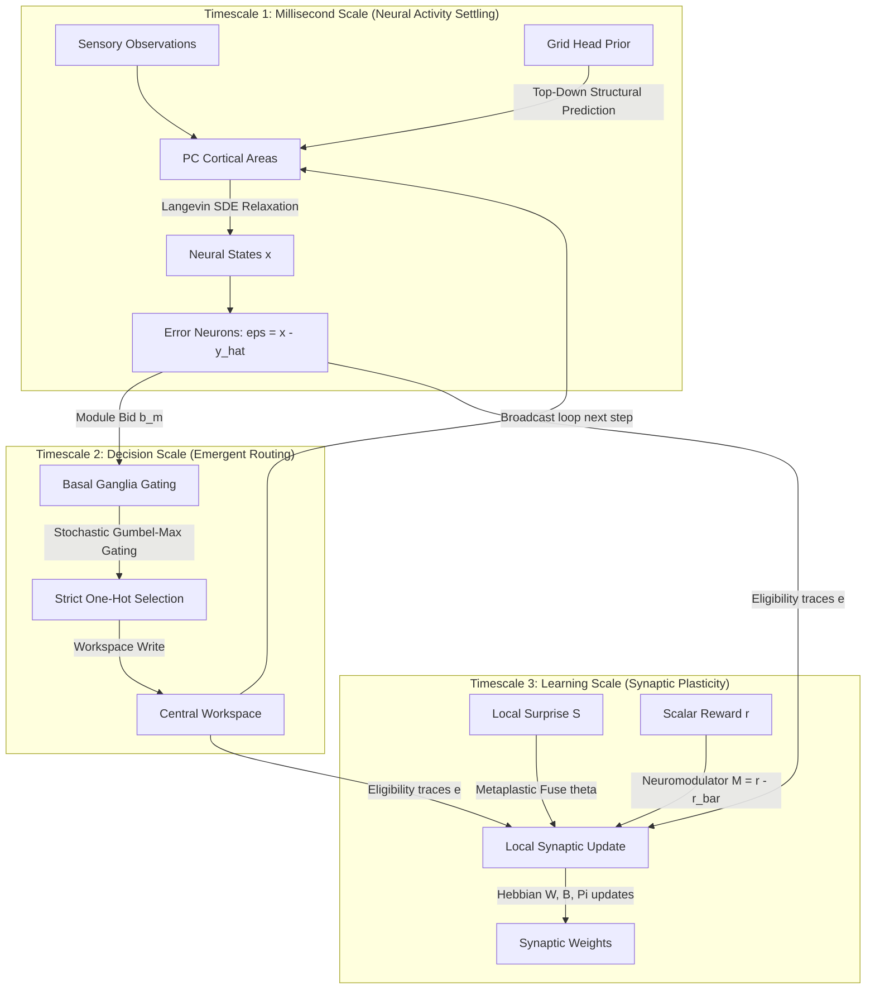

# CEREBRUM — Grid-Referenced Annealed Inference with Local Plasticity

CEREBRUM is a **predictive-coding, backpropagation-free, fully-local-plasticity** learning
architecture aimed at neuromorphic edge substrates. Inference, routing, and learning are all noisy
gradient descent on **one** free-energy functional `F`, at three timescales. There is **no
backpropagation, no autograd, and no weight transport** anywhere in the `cerebrum/` package — every
weight, feedback, and precision update is a hand-written local rule. (Arrays are PyTorch tensors so
the code can move to GPU/MPS, but `torch.autograd` is never used; the only backprop in the repo is
the clearly-labelled comparator under `benchmarks/baselines/`.)

> ### Scope — read this before the numbers
>
> **This project solves zero open problems and makes no scaling claim.** It is an exploratory
> research bet whose riskiest part is unproven. The results below include several **negative
> findings that go against the central bet**, and they are reported here on purpose. Sections
> [6](#6-honest-status--what-is-and-is-not-solved) and
> [8](#8-the-honest-frontier--where-cerebrum-holds-and-where-it-breaks) are the ones to read
> if you want to know what this does *not* do.
>
> No physical robot exists. `physical_validation.py`, `run_physical_validation.py` and
> `power_parser.py` are a **mock** harness (`MockHardware`, a generated mock `tegrastats` log);
> nothing here has ever run on a Jetson, an SBC, a CAN bus, or a motor. There are no power or
> latency measurements from hardware in this repository.

---

## 1. The five pillars

| Pillar | Mechanism in CEREBRUM |
|---|---|
| **1. Predictive-coding substrate** | Each cortical area `l` has a physically separate error-neuron population `ε_l = x_l − ŷ_l`. Inference = activities settling to minimise precision-weighted error. Errors flow, not raw activations. |
| **2. Fully-local plasticity** | Four-factor Hebbian `τ_w Ẇ = M·θ·Π·ε·e`; every factor is physically present at the synapse. The same `ε` that drives settling drives learning. |
| **3. Structured generative prior** | TEM-style grid × sensory factorisation; frozen Lie-group rotation transitions driven by an **exogenous** action. This is the source of the sample-efficiency win. |
| **4. Stochastic inference** | Langevin SDE settling `τ_x dx = −∂F/∂x dt + √(2τ_x T) dW`; samples an approximate posterior instead of collapsing to MAP (`T ≥ T_floor > 0`). |
| **5. Neuromorphic substrate** | Settling = analog device relaxation; intrinsic device noise = the Langevin floor; only the scalar `M` crosses the whole chip at learn time. |

Because feedback uses `B ≠ Wᵀ`, the functional `F` as written is the **surrogate** vector field the
substrate actually descends. The identity `F = −log p(x, g, data)` holds exactly only in the
symmetric limit `B = Wᵀ`; with `B ≠ Wᵀ` the drift is non-conservative — no scalar potential, no
Lyapunov guarantee. This is a stated failure mode, not a hidden one.

---

## 2. Working principles — three timescales


```mermaid
graph TD
    subgraph "Timescale 1: Millisecond Scale (Neural Activity Settling)"
        Sensory[Sensory Observations] --> PCA[PC Cortical Areas]
        GridPrior[Grid Head Prior] -->|Top-Down Structural Prediction| PCA
        PCA -->|Langevin SDE Relaxation| Act[Neural States x]
        Act --> Err[Error Neurons: eps = x - y_hat]
    end

    subgraph "Timescale 2: Decision Scale (Emergent Routing)"
        Err -->|Module Bid b_m| BG[Basal Ganglia Gating]
        BG -->|Stochastic Gumbel-Max Gating| Win[Strict One-Hot Selection]
        Win -->|Workspace Write| WS[Central Workspace]
        WS -->|Broadcast loop next step| PCA
    end

    subgraph "Timescale 3: Learning Scale (Synaptic Plasticity)"
        Err -->|Eligibility traces e| Plast[Local Synaptic Update]
        WS -->|Eligibility traces e| Plast
        Surp[Local Surprise S] -->|Metaplastic Fuse theta| Plast
        Reward[Scalar Reward r] -->|Neuromodulator M = r - r_bar| Plast
        Plast -->|Hebbian W, B, Pi updates| Synapses[Synaptic Weights]
    end
```

**Timescale 1 — settling.** State variables settle under Langevin SDEs to minimise local free
energy. Local error populations compute `ε_l = x_l − ŷ_l`; these errors drive state updates.

**Timescale 2 — routing.** Each module `m` emits a **scalar own-error bid**
`b_m = π_m·E[‖ε_m‖²] + θ_m`; a striatal Go/NoGo gate draws a **stochastic strict-one-hot** winner
per workspace slot (Gumbel-argmax = exact softmax sample, never a plain argmax); the winner's
content is written one-hot into a slot and broadcast back as a top-down prediction. That closed loop
is the **only** token-mixing pathway — there is no attention matrix and no query-key term.

**Timescale 3 — learning.** Synapses update locally. A scalar neuromodulator `M = r − r̄`
coordinates learning globally; a per-synapse metaplastic fuse `θ = σ(g(S − c))` gates it; feedback
weights `B` update by an independent local rule so no update ever reads `Wᵀ`.

---

## 3. The bans — enforced as invariants in code

These are not style preferences; they are the line separating CEREBRUM from backprop / DFA /
weight-transport methods. A violation invalidates the project. See `cerebrum/invariants.py`,
`cerebrum/types.py`, and the test suite.

1. **No backpropagation / no autograd** anywhere in `cerebrum/`. Every update is a hand-written
   local rule. The only exception is `benchmarks/baselines/backprop_mlp.py`, a clearly-labelled
   baseline *comparator* — it is not part of CEREBRUM.
2. **No weight transport.** No update reads `Wᵀ`. Feedback uses a separate array `B`, updated by
   its own local rule (`cerebrum/plasticity.py`).
3. **Scalar neuromodulator.** `M` is a scalar; no vector global signal ever enters a weight update
   (a vector global signal would be DFA).
4. **Exogenous `z_act`.** `GridHead.transition(...)` accepts **only** an `Exogenous(...)` wrapper;
   a plain (possibly data-derived) `ndarray` raises `TypeError`. `x` / `W` / gate outputs are never
   wired into `z_act`.
5. **No sequence-mixer** (linear attention / delta rule / state-space / softmax attention).
6. **Success axis is sample efficiency**, not throughput, perplexity, or wall-clock latency.

---

## 4. Where CEREBRUM is aimed

Edge and neuromorphic settings where backpropagation is physically awkward: on-device continual
learning, sample-efficient spatial mapping, and closed-loop active-inference control. These are
**design targets**, not demonstrated deployments — see the scope box at the top.

---

## 5. Results that hold

### Task-1: few-shot graph completion (Pillar 3)

Fraction of *unobserved* graph edges correctly predicted after `K` observations on a 4×4 gridworld
(mean ± 95% CI over 5 seeds; chance = 1/vocab = 0.200). The load-bearing claim is **grid > flat**.
Reproduce: `python3 benchmarks/run_task1.py`.

| K | CEREBRUM-grid | flat-prior | backprop-MLP |
|---|---|---|---|
| **5** | **0.562 ± 0.194** | 0.168 ± 0.189 | 0.182 ± 0.178 |
| **10** | **0.381 ± 0.079** | 0.189 ± 0.085 | 0.230 ± 0.164 |
| **20** | **0.338 ± 0.056** | 0.225 ± 0.073 | 0.228 ± 0.168 |

At `K=10` and `K=20` the intervals are cleanly separated; at `K=5` per-seed variance is high, so the
large mean gap carries a wide CI. This is a small structured task, not evidence of scaling.

**Larger metric graphs — the margin holds and widens.** `python3 benchmarks/run_largegraph.py`
(8 seeds; chance = 1/vocab per row):

| size | K | CEREBRUM-grid | best baseline | margin | coverage |
|---|---|---|---|---|---|
| 8×8 v10 | 10 | **0.445 ± 0.120** | 0.138 ± 0.076 | +0.31 | 0.12 |
| 8×8 v10 | 40 | **0.307 ± 0.081** | 0.164 ± 0.053 | +0.14 | 0.37 |
| 12×12 v12 | 10 | **0.535 ± 0.124** | 0.173 ± 0.101 | +0.36 | 0.05 |
| 12×12 v12 | 40 | **0.305 ± 0.058** | 0.111 ± 0.044 | +0.19 | 0.16 |
| 16×16 v16 | 10 | **0.550 ± 0.118** | 0.101 ± 0.092 | +0.45 | 0.03 |
| 16×16 v16 | 40 | **0.369 ± 0.087** | 0.127 ± 0.048 | +0.24 | 0.09 |

CI-separated at every K and size. **Honest caveat:** at fixed `K` a bigger graph means a *smaller*
observed coverage fraction, so absolute accuracy tracks coverage, not capability; the **margin** is
the capability signal. Same metric prior, bigger graph — still not a scaling claim.

### Stage-2: routing emerges without an attention matrix (Pillar 5)

Selective-routing ("binding") task, 5 seeds. Two operating points, two claims. Reproduce:
`python3 benchmarks/run_stage2.py`.

**2A — routing clears chance.** At a low selection temperature plus a small Go/NoGo weight decay,
while still drawing a *stochastic* one-hot sample:

| Configuration | One-hot routing acc | Win entropy |
|---|---|---|
| **[M=4] (chance = 0.250)** | **0.723 ± 0.265** | 1.356 ± 0.016 |
| **[M=6] (chance = 0.167)** | **0.753 ± 0.214** | 1.730 ± 0.087 |

High win-entropy confirms load stays balanced — no dead or hog expert.

**2B — write-rule ablation** at a moderate `gate_temp = 0.5` where the selection distribution
actually spreads (matched temperature; only the write rule differs):

| Configuration | One-hot routing | Soft-mixer routing | Slot participation (soft) |
|---|---|---|---|
| [M=4] | **0.623 ± 0.235** | 0.258 ± 0.209 | 2.35 ± 0.45 |
| [M=6] | **0.672 ± 0.221** | 0.423 ± 0.198 | 2.15 ± 0.42 |

Relaxing the strict one-hot write to the **banned** soft aggregation turns the workspace into a
content-gated linear recurrent mixer: it blends ~2.2–2.4 modules per slot (the participation CI
cleanly excludes 1.0) and routes worse. **Strict one-hot discreteness is load-bearing, not
cosmetic** — but note the honest limit: the routing gap is CI-separated at M=4 and only a mean
difference at M=6, where the intervals overlap. The participation number is the cleaner signal.

Honesty gate: the gate does **salience-driven + fixed-preference** routing, not content-addressed
routing (that would be attention, which is banned). On this small task the routing numbers are a
property of the bid signal and selection temperature, not evidence of scaling. Infer-time broadcast
traffic is **not** O(1); only the learn-time scalar `M` is.

### Stage-3: the metaplastic fuse reduces catastrophic forgetting (Pillar 2)

Sequential reconstruction stream A→B→C with **no replay, no iid mixing, no task-boundary signal**.
`forgetA` = (error on A after C) − (error on A after A); 8 seeds, a **single fixed knob set**, and a
noise-free (`T=0`) measurement readout. Lower is better. Reproduce:
`python3 benchmarks/run_stage3.py`.

| Method | forgetA | errC after C | Extra requirements |
|---|---|---|---|
| **CEREBRUM-fuse** | **0.002 ± 0.039** | 1.034 ± 0.137 | none (fully local) |
| always-plastic (`θ≡1`) | 0.557 ± 0.178 | **0.635 ± 0.089** | none |
| EWC-analog | 0.109 ± 0.047 | 0.864 ± 0.140 | Fisher pass + stored weight anchors |

The fuse is lower on **every** seed (8/8) and the 95% CIs are cleanly separated (fuse upper 0.041 <
plastic lower 0.379), without EWC's Fisher pass or stored anchors.

**Read the second column too.** The fuse buys that protection by freezing: its error on the *newest*
task (1.034) is the **worst** of the three, well above always-plastic (0.635) and EWC (0.864). The
consolidation reserve saturates (`c̄ ≈ 0.99`). This is the plastic-death horn of FM4 showing up in
the headline table, not a footnote — §8d quantifies it as a paired per-seed tax.

This does **not** make stability-plasticity "solved" — it stays a tuned knife-edge with no stability
proof (spec failure mode FM4), with two ways to fall off: catastrophic forgetting (`θ` never closes)
and plastic-death (`θ` never reopens). See §8 for the budget at which it actually breaks.

### Task-3: energy and operations

Reconstruction task, noise-free (`T=0`) measurement. Reproduce: `python3 benchmarks/run_energy.py`.

| pass | recon err | eps sparsity @0.1 | dyn ops | dyn energy |
|---|---|---|---|---|
| 0 | 1.2787 | 0.833 | 133.3 | 47.12 |
| 30 | 0.3842 | 0.633 | 101.3 | 26.08 |
| 300 | 0.2848 | 0.633 | 101.3 | 22.69 |

Reconstruction error falls ~4.5× and magnitude-weighted dynamic switching energy ~2.1×. A matched
dense backprop net does 320 MAC ops/step with no decay, and its learn-time global communication is
16 error-vector elements versus CEREBRUM's 1 scalar `M`.

**Honesty gate.** Only the **dynamic** switching term decays. **Static/leakage power and settle-time
energy do not**, and iterative settling can cost *more* steps precisely when the posterior is
interesting (FM2). This is a small task and explicitly **not** a wall-clock or scaling claim. None
of it is a hardware measurement.

### Pillar-4: calibrated uncertainty

Drawing S = 21 stochastic settles per query at the native noise floor and asking whether their
*disagreement* predicts error (`python3 benchmarks/run_uncertainty.py`, 16 seeds):

| metric | value |
|---|---|
| AUROC (sample-entropy → error) | **0.709 ± 0.099** |
| AUROC (disagreement → error) | **0.614 ± 0.087** |
| mean disagreement when correct / when wrong | 0.084 ± 0.069 / 0.137 ± 0.072 |
| calibration gap (confident − uncertain accuracy) | 0.185 ± 0.635 — **fragile**, do not quote |

Both AUROC CIs clear the 0.5 null, and the model is reliably more often wrong where its noisy
settles disagree. **Modest but real**, and it is a capability a single deterministic forward pass
does not natively provide.

*Discrepancy worth flagging:* the runner's own narration says raising `T` to 1.0 "washes out"
the calibration, but the control block it prints does not support that — at `T=1.0` the
disagreement→error AUROC is 0.723 ± 0.075, i.e. no worse. Only the *discrete* confident/uncertain
split degenerates. The claim that the effect lives specifically at the native floor is therefore
**not** supported by this script's output and is not made here.

---

## 6. Honest status — what is and is NOT solved

CEREBRUM solves **zero** open problems. The architecture is a **bet**, and the riskiest part of that
bet is unproven.

| Open problem | Honest status |
|---|---|
| **Scaling** | **NOT solved — an UNPROVEN bet.** No fully-local, transport-relaxed, noisy-sampling method has matched backprop on hard tasks. With `B ≠ Wᵀ` the rule does not even provably recover the true gradient at the fixed point. |
| **Backward-weight wart** | **Relaxed, not solved.** `B` replaces `Wᵀ` as a feedback-alignment-class approximation; transpose recovery is not guaranteed. |
| **Stability-plasticity** | **Genuinely addressed, NOT solved.** No stability proof; the `(θ,c)` loop is a tuned knife-edge that can fail toward catastrophic forgetting **or** plastic-death (FM4), and its protection is budget-bounded (§8d). |
| **Global coherence** | **Pressured, not guaranteed.** |
| **Dead experts** | **Addressed, fragile in both directions.** No closed-form setpoint. |

**Explicit non-claims (these may NEVER be asserted about CEREBRUM):**

- No claim that **scaling is solved**. Scaling is an unproven bet.
- No claim that **stability-plasticity is solved**. The fuse carries no stability proof.
- No claim of **O(1) global communication**. Learn-time scalar comm is a *target*; infer-time
  broadcast/routing traffic is not O(1).
- No claim of any **hardware, power, thermal, or latency** result. Nothing was measured on a device.

Losing to a transformer on GPU throughput is **expected and acceptable**. The only success axis
claimed here is **sample efficiency** on structured relational tasks.

---

## 7. Frontier map at a glance

| Probe | Axis | Verdict | Why (one line) |
|---|---|---|---|
| Larger metric graphs (→16×16) | sample-eff | **HOLDS, margin widens** | same metric grid prior; baselines decay toward a falling chance floor |
| Transitive inference (→N=25) | sample-eff | **HOLDS, distinct at scale** | linear order is the grid's native metric; O(1)-in-distance comparison |
| Non-metric / directed **digraphs** | sample-eff | **BREAKS (→ baseline)** | the grid assumes commutative/metric composition; directed paths do not compose (FM7) — §8b |
| Directed **trees**, opt-in non-commutative prior | sample-eff | HOLDS **for that opt-in prior only** | stack-based (non-metric) path integration, not the metric grid prior — §8b |
| Longer continual streams (→10 tasks) | continual | HOLDS (creeps) | `forgetA` drifts 0.038 → 0.124, stays ≪ always-plastic |
| Task similarity / interference | continual | HOLDS, **with a plastic-death tax** | overlap gives positive transfer to A; the cost shows up as worse newest-task error — §8d |
| Continual training budget (passes) | continual | **BREAKS ≥ 300 passes** | fixed `tau_c`/`beta_c`: more budget = more erosion of A's reserve (FM4) — §8d |
| Compositional structure from local plasticity (depth 2/3/4) | **the central bet (OP1)** | **NULL** | depth changes the result by **+0.000**; within-distribution completion sits at chance — §8a |
| Factored-latent linear decode (isolated module) | the central bet, weaker readout | HOLDS | held-out `f1`/`f2` decode 0.920 ± 0.051 vs chance 0.167, above untrained and random-projection controls — §8e |
| More factors / cardinality (K→4, card→8) | the central bet, scaled | **learned-over-input margin BREAKS by card ≈ 8** | at high cardinality a random projection of the concat obs decodes the factors too |
| Factorisation in the FULL pipeline | robustness of the central bet | **BREAKS** | survives broadcast and fuse; the grid top-down drops it to 0.450 and the full `CerebrumNet` to 0.485, both *below* the 0.825 untrained control — §8c |
| Settling noise load-bearing for accuracy? | Pillar 4 | **NULL** | no `T>0` beats `T=0` on any axis; past the shipped default it hurts continual retention — §8f |

**Reading:** the demonstrated sample-efficiency win lives specifically in the **frozen metric
structured prior**. The local learning rule on its own does **not** induce compositional structure at
this scale, and the factorizer and the structured prior **compete rather than cooperate** in the
integrated system. This is the honest state of the central bet — and it is **emphatically not a
scaling-solved claim.**

---

## 8. The honest frontier — where CEREBRUM holds and where it breaks

Every subsection below is a *negative or two-sided* result. They are the most informative part of
this repository and they are reproducible from the committed benchmark scripts.

### (a) Compositional structure from local plasticity — **NULL** (against the central bet)

Remove the grid HEAD and put depth on the causal path: inputs are `concat(P1[f1], P2[f2])` from two
independent frozen factors; train online with the local four-factor rule on 13/16 combinations; test
compositional generalisation by **PC pattern-completion** — clamp the `f1` part, leave the `f2` part
free, settle (`T=0`), read the completed `f2`. Compare PC depth 2 vs 3 vs 4.
`python3 benchmarks/run_compositional.py` (5 seeds, chance = 0.25):

| PC depth | held-out compositional acc | within-distribution acc | latent \|x\| |
|---|---|---|---|
| 2 areas | 0.200 ± 0.227 | 0.262 ± 0.052 | 0.0590 |
| 3 areas | 0.200 ± 0.227 | 0.262 ± 0.052 | 0.0386 |
| 4 areas | 0.200 ± 0.227 | 0.262 ± 0.052 | 0.0275 |

(flat memorizer 0.000 ± 0.000; backprop-MLP comparator 0.067 ± 0.185 — **no** method composes here.)

**Verdict: NULL, and it is the most important honest finding.** Depth changes the result by
**+0.000** — bit-identical per seed. The mechanism is diagnostic: the latent code is near-silent and
gets *more* silent with depth (`|x|` 0.059 → 0.039 → 0.028; the `−Πε` drift with `top_pred = 0`
decays each latent toward zero), the completed `f2` stays tiny in norm (~0.19 at every depth), and
**even within-distribution completion sits at chance**. The local four-factor rule on this budget **never
builds a latent that binds `f1→f2` in the first place**, so there is no hierarchical factorisation
for any depth to consult (verified robust to `eta`, width, `gamma`, feedback strength).

**This is direct evidence against the central unproven bet (spec OP1):** at this scale, fully-local
plasticity does **not** induce the compositional/hierarchical representation that backprop would.
That is exactly the open problem, surfaced rather than papered over.

*Caveat in both directions:* a weaker readout — a linear *decode* of the factors rather than a
*completion* of them — does find factor structure in the same latents (§8e). The completion probe
above is the harder question, and on it the answer is null; the decode probe is the easier question,
and on it the answer is positive. Both are reported.

### (b) Non-metric / directed graphs — the structured prior **BREAKS to baseline**

The grid prior is an inductive bias for **metric, path-independent** structure. On a random
**directed** graph (edges do not commute) the advantage collapses. `python3
benchmarks/run_relational.py` (5 seeds, 95% CI, chance = 1/vocab = 0.200):

| task | K | CEREBRUM-grid | flat-prior | backprop-MLP |
|---|---|---|---|---|
| **metric** gridworld | 10 | **0.381 ± 0.079** | 0.189 ± 0.085 | 0.230 ± 0.164 |
| **non-metric** digraph | 5 | 0.518 ± 0.454 | 0.461 ± 0.486 | 0.271 ± 0.313 |
| **non-metric** digraph | 10 | 0.322 ± 0.032 | 0.233 ± 0.100 | **0.335 ± 0.140** |
| **non-metric** digraph | 20 | 0.357 ± 0.033 | 0.256 ± 0.104 | **0.364 ± 0.076** |

**Verdict: BREAKS (→ baseline).** On the metric task CEREBRUM is ~2× the flat prior and beats the
MLP. On the non-metric digraph the backprop-MLP **matches or edges out** CEREBRUM at every K where
the CIs are readable (K=20: MLP 0.364 ± 0.076 vs CEREBRUM 0.357 ± 0.033). The K=5 row is unreadable
— the ±0.45 interval spans everything — and is shown rather than dropped. **The grid prior is a
*metric* prior, not a universal relational one.**

**Why (spec failure mode FM7).** The grid HEAD integrates exogenous path steps linearly in a 2-D
Euclidean coordinate system (`x_next = x + v`), which forces transition compositions to commute. On
a directed hierarchy they do not (left-then-right and right-then-left land on different nodes), so
distinct nodes are forced onto identical grid codes. Loop closure makes it worse: returning to a
parent from either child requires `v_left + v_parent = 0` and `v_right + v_parent = 0`, implying
`v_left = v_right`, which collapses the two branches onto one line.

**Directed trees, with a different prior.** An opt-in **non-commutative, stack-based** path
integration (`CerebrumConfig(non_commutative_prior=True)`) was added specifically for hierarchies,
and on directed trees it does beat the flat prior (K=10: 0.900 ± 0.176 vs 0.643 ± 0.123; K=5:
0.923 ± 0.214 vs 0.687 ± 0.165, same command as above). That is a genuine result for **that opt-in
prior on trees** — it is *not* a rescue of the metric grid prior, which still breaks on general
digraphs as the table shows, and it does not generalise to arbitrary non-metric structure.

**Transitive inference (a metric/linear order) → the prior HOLDS.** Train on adjacent pairs only,
test never-co-observed non-adjacent pairs (`python3 benchmarks/run_transitive.py`):

| axis | CEREBRUM-grid | flat-prior | backprop-MLP |
|---|---|---|---|
| N=7 order | **1.000 ± 0.000** | 0.587 ± 0.283 | 1.000 ± 0.000 |
| N=15 order | **1.000 ± 0.000** | 0.488 ± 0.212 | 0.954 ± 0.038 |
| N=25 order | **1.000 ± 0.000** | 0.449 ± 0.108 | 0.634 ± 0.102 |

**Anti-cherry-pick caveat (not hidden):** at the easy size **N=7 the backprop-MLP also hits 1.000**,
so the grid is **not** distinctively better there. The separation appears only in the discriminating
regime — at N=25 the MLP decays to 0.634 while CEREBRUM stays at 1.000.

### (c) Does the factored latent survive the FULL pipeline? — **BREAKS**

§8e measures the factored latent on a **bare** `PCAreas`. This asks whether that result survives when
the same cortical module runs inside the richer `cerebrum/unified.CerebrumNet` dynamics — grid-HEAD
structural top-down, thalamo-cortical workspace broadcast, and the metaplastic fuse, individually and
all together. Same linear-probe measurement, same untrained and random-projection controls.
`python3 benchmarks/run_factorization_pipeline.py` (2-factor card=6, part_dim=8, dims=(obs,24,24),
5 seeds, chance 0.167):

| condition | what's added | trained (held-out) | untrained (init) | random-proj | trained latent \|x\| | verdict |
|---|---|---|---|---|---|---|
| bare | nothing | **0.920 ± 0.051** | 0.825 ± 0.038 | 0.850 ± 0.108 | 0.118 | **SURVIVES** (beats untrained) |
| broadcast | workspace efference copy → bottom area | **0.925 ± 0.054** | 0.825 ± 0.038 | 0.850 ± 0.108 | 0.119 | **SURVIVES** (beats untrained) |
| fuse | metaplastic `θ∈[0,1]` gates the four-factor update | **0.890 ± 0.047** | 0.825 ± 0.038 | 0.850 ± 0.108 | 0.153 | **SURVIVES** (beats untrained) |
| grid | grid-HEAD structural top-down at the TOP area | 0.450 ± 0.132 | 0.825 ± 0.038 | 0.850 ± 0.108 | **70.2** | **BREAKS** — below untrained |
| full | grid + gate + workspace + fuse (real `CerebrumNet`) | 0.485 ± 0.071 | 0.825 ± 0.038 | 0.850 ± 0.108 | **64.3** | **BREAKS** — below untrained |

**Verdict: the bare result survives broadcast and fuse, but the grid top-down — and therefore the
full `CerebrumNet` — destroys it.** Read the mechanism straight off the `|x|` column: the bare
cortical latent is a small, sparse, obs-driven code (`|x| ≈ 0.12`). `CerebrumNet` binds the
observation into the grid HEAD's Hebbian **content store** every step and **never decays it**, so its
structural top-down prediction reaches norm ≈ 70, several hundred times the bare latent. That
prediction is consumed at the module's **top area**, so the latent tracks per-combo grid *phase*
instead of the obs factors. Both disrupted conditions land **below the untrained control (0.825)** —
i.e. under a dominating structural prior, *learning actively worsens* the linearly-decodable factor
code. The script's own verdict line reads `factorization DISRUPTED in: ['grid', 'full']`.

**The honest implication for OP1: the factored latent and the structured grid prior are two separate
sample-efficiency levers that compete rather than cooperate.** Composing them is open frontier work,
not a solved property.

**The opt-in "fix" does NOT resolve it.** Two flags (`balance_grid_precision`,
`subspace_segregation`, both default **OFF**, enabled together in this benchmark by
`CEREBRUM_BALANCE_GRID_PRECISION=1`) precision-balance the grid top-down against the bottom-up signal
scale. Re-running with them on:

| condition | trained | untrained (init) | learned margin | verdict |
|---|---|---|---|---|
| bare | 0.775 ± 0.098 | 0.740 ± 0.125 | +0.035 | **no learned margin** |
| grid | 0.790 ± 0.100 | 0.740 ± 0.125 | +0.050 | grid disruption removed |
| broadcast | 0.775 ± 0.098 | 0.740 ± 0.125 | +0.000 | no learned margin |
| fuse | 0.760 ± 0.107 | 0.740 ± 0.125 | +0.020 | no learned margin |
| full | 0.765 ± 0.084 | 0.740 ± 0.125 | +0.025 | **no learned margin** |

The flags do remove the `|x| ≈ 70` blow-up (every latent norm drops back to ~0.1–0.2) and the
`grid` condition stops being disrupted. But they do **not** restore a learned factor code in the full
pipeline: `full` lands at 0.765 against an untrained control of 0.740 — statistically indistinguishable
— and the **bare** condition loses its learned margin too (0.775 vs 0.740, down from 0.920 vs 0.825).
The flags equalise every condition toward the untrained baseline rather than making the levers
cooperate.

So: **full-pipeline factorisation is an OPEN issue, not resolved.** It is also not merely
under-training — running the full network at the fast `eta ≈ 0.6` for up to 150 passes did not
recover it either. Anyone quoting a single "full pipeline decode = 0.88" figure should check it
against the untrained control printed on the adjacent line, which at those settings is the same
number.

### (d) Continual learning — protection is **BUDGET-BOUNDED** (the FM4 break)

`python3 benchmarks/run_continual_hard.py` (8 seeds, `T=0` eval, single fixed knob set) stresses the
metaplastic fuse on three axes. The numbers below are quoted from the committed run,
`continual_hard_out.log`. A fresh re-run on this checkout reproduces **every verdict** — same
HOLDS/BREAKS pattern, same break point, same sign and ordering of the tax — with the means drifting
by at most ~0.015 (e.g. the 200-pass `forgetA` reads 0.152 in the committed log and 0.142 on
re-run). Treat the third decimal as noise; the verdicts are what carry.

**Axis 1 — longer streams.** `forgetA` creeps 0.038 → 0.124 across 3 → 10 tasks but stays
CI-separated below always-plastic (~0.40) at every length. Length alone does not break protection
up to 10 tasks.

**Axis 2 — task similarity, and the price of protection.** As tasks share more input subspace,
`forgetA` actually *drops* (even negative at high overlap): later tasks partly re-fit A. The
interference cost surfaces instead as a **plastic-death tax** — the fuse is worse than always-plastic
on the *newest* task, per-seed paired:

| similarity | plastic-death tax (fuse − plastic, newest-task error) | fuse lastErr | plastic lastErr |
|---|---|---|---|
| 0.00 | **0.192 ± 0.076** | 0.518 | 0.326 |
| 0.50 | 0.135 ± 0.052 | 0.484 | 0.349 |
| 0.75 | 0.118 ± 0.059 | 0.456 | 0.338 |
| 1.00 | 0.109 ± 0.071 | 0.431 | 0.323 |

**That tax is the cost of the method** and it is the other horn of FM4: protecting A means the fuse
freezes shared synapses and learns the newest task measurably worse.

**Axis 3 — training budget: the clean break.**

| passes/task | fuse forgetA | always-plastic forgetA | CIs separated? | verdict |
|---|---|---|---|---|
| 100 | 0.072 ± 0.044 | 0.395 ± 0.146 | yes | HOLDS |
| 150 | 0.116 ± 0.060 | 0.410 ± 0.157 | yes | HOLDS |
| 200 | 0.152 ± 0.072 | 0.394 ± 0.136 | yes | HOLDS |
| 300 | 0.220 ± 0.103 | 0.406 ± 0.153 | **no** | **BREAKS** |
| 400 | 0.269 ± 0.125 | 0.407 ± 0.152 | **no** | **BREAKS** |
| 600 | 0.324 ± 0.147 | 0.410 ± 0.147 | **no** | **BREAKS** |

**Verdict: separated-CI protection holds at 100/150/200 passes and breaks at 300/400/600 — a clean
break point around 150–200 passes.** With fixed `tau_c`/`beta_c`, a larger per-task budget gives the
later tasks more erosion cycles on the shared synapses than the knob set anticipates, so A's
consolidation reserve wears down until its CI overlaps always-plastic. **This is exactly spec FM4: a
tuned knife-edge, not a proof — protection-without-retuning is budget-bounded, not unconditional.**

**Retune disclosure.** The break point moved from "≥200 passes" to "≥300 passes" because the
consolidation timescale in the continual harness was retuned (`benchmarks/tasks/continual.py`:
`TAU_C` 80.0 → 40.0, with `BETA_C = 4.0`) together with a surprise-deviation margin added to
`MetaplasticFuse`. The numbers above are from the run at those knobs. The premise of a "single fixed
knob set, no per-task retuning" applies *within* a run; it does not mean the knobs were never tuned
to the task family. Read the break point as ~150–200 passes for the pre-retune knobs and ~200–300
for the current ones — either way it is budget-bounded.

### (e) The weaker readout: linear-decodable factor structure — HOLDS, with limits

Training the bare PC hierarchy with the same local rule and then fitting a **linear readout on seen
combos** (nearest-class-mean and logistic; a *measurement probe only*, exactly like the
`backprop_mlp` comparator — CEREBRUM itself is unmodified and does no backprop), the factors are
decodable on **held-out** combos: **0.920 ± 0.051** vs chance 0.167, above an untrained
same-architecture latent (0.825) and above a same-dim random projection of the obs (0.850).
`python3 benchmarks/run_factorization.py`.

Three honest limits attach to it:

1. It is a **decode**, not a **completion**. The harder completion question is null (§8a).
2. **The learned-over-input margin BREAKS at high cardinality.** Pushed to K=3/4 factors and
   per-factor cardinality 4→8 (`python3 benchmarks/run_factorization_multi.py`), the margin over
   *init* grows (+0.07 → +0.13) but the margin over a same-dim **random projection of the obs**
   shrinks to zero (+0.05 → +0.00 by card = 8). The obs is `concat(parts)`, so the factor subspaces
   are axis-aligned in the input; at large cardinality a random projection preserves them
   (Johnson–Lindenstrauss) and the trained latent is no better than the trivially-factorable input.
3. Turning **Kolen-Pollack feedback alignment on** (`align_feedback=True`) *degrades* held-out factor
   decode to **0.420 ± 0.123 — well below the untrained latent (0.825)**. Forcing `B→Wᵀ` alignment
   makes the factored structure worse at this scale. The script's own verdict for that condition is
   `LEARNING DEGRADES THE LATENT`. Reported as-is.

   A separate probe on the *completion* task (`python3 benchmarks/run_align_feedback.py`) is
   consistent with §8a: alignment works as a local rule (the `B`/`Wᵀ` cosine rises from −0.012 to
   +0.813 versus +0.337 with the flag off) and aligned settling lowers bottom-layer reconstruction
   error, yet within-distribution completion **stays at chance** (0.262 ± 0.052) and held-out
   completion does not move (0.200 ± 0.227, identical to the flag-off run). Feedback alignment is
   necessary-looking but **not sufficient** for OP1 here.

Under harder **systematic** splits (`python3 benchmarks/run_factorization_splits.py`, 12 seeds) the
*paired* learned margin over init stays CI-positive at card=8 (few-context +0.116 ± 0.052; row/block
+0.150 ± 0.064) and is larger than under a random split — but the learned-beyond-*input* margin is
≈0 throughout, the same ceiling as limit 2. So this is a **systematicity-of-the-learned-margin**
result, not a claim of decoding beyond the input.

### (f) Is the Pillar-4 settling noise load-bearing? — **NOT for accuracy**

Sweeping `T_floor ∈ {0, …, 0.2}` across the three core tasks
(`python3 benchmarks/run_pillar4_ablation.py`, 5 seeds):

| axis | T=0 (deterministic) | best T>0 | script verdict |
|---|---|---|---|
| Task-1 few-shot | 0.427 ± 0.075 | 0.427 ± 0.075 (**bit-exact at every T**) | **NEUTRAL / structural null** — completion reads the grid store, never the settled `x` |
| Stage-2 routing | 0.761 ± 0.138 | 0.775 ± 0.124 (T=0.01) | **NEUTRAL** — CIs overlap; load balance comes from Gumbel + homeostasis, not settling noise |
| Stage-3 forgetA (fuse, lower better) | **−0.074 ± 0.053** | −0.029 ± 0.059 (T=0.01) | **NEUTRAL by the script's test; deterministic is best on the mean** |

**Verdict: the *settling* noise is NOT load-bearing for accuracy on these tasks.** Deterministic
settling is as good or better on all three axes; no `T > 0` setting CI-separates above `T = 0`
anywhere. On continual retention it is worse than neutral as `T` grows: `forgetA` goes
−0.074 (T=0) → 0.019 (T=0.02, the shipped default) → 0.162 ± 0.073 (T=0.05) → 0.249 ± 0.079
(T=0.1), and from `T ≥ 0.05` the interval is cleanly separated *above* deterministic. So noise
does not help, and past the shipped default it demonstrably hurts retention.

The collapse-prevention the spec attributes to Pillar 4 is actually done by a *different* noise
source — the gate's Gumbel sampling plus homeostasis — which this ablation leaves on. This
challenges Pillar-4's load-bearing framing and is recorded as such. The one genuine payoff of the
settling noise is the calibrated uncertainty signal in §5: a two-sided result, neither the spec's
strong claim nor a flat dismissal.

---

## 9. Repository layout

```
cerebrum/                # the CEREBRUM package (PyTorch tensors, NO autograd)
  config.py              # CerebrumConfig — all hyperparameters and feature flags
  rng.py                 # SeededRNG — reproducible, zeroable Langevin noise
  types.py               # Exogenous wrapper (enforces z_act exogeneity by construction)
  invariants.py          # executable BAN assertions
  counters.py            # synaptic-op and global-communication counters (LEARN vs INFER)
  nonlinear.py           # activation and derivative
  pc_core.py             # PC areas: predictions, error neurons, diagonal precision, Langevin step
  plasticity.py          # eligibility traces, four-factor weight rule, feedback-B rule, precision
  neuromod.py            # scalar neuromodulator M
  grid_head.py           # structured grid prior: frozen modules, path integration, content store
  metaplasticity.py      # MetaplasticFuse — consolidation reserve c, surprise baseline, theta gate
  gate.py                # BasalGangliaGate — scalar bids, striatal Go/NoGo, stochastic one-hot
  workspace.py           # Workspace — k slots, strict one-hot write, broadcast
  core_net.py            # CerebrumCore (Stage 1: PC areas + grid HEAD)
  workspace_net.py       # CerebrumWorkspaceNet (Stage 2: modules + gate + workspace loop)
  unified.py             # CerebrumNet — all five pillars in one step()
  hippocampus.py         # one-shot episodic key-value store with LRU eviction
  energy.py              # energy/op accounting
  grounding/             # sensory-motor grounding (sensory, motor, physics, ros_node, reflex,
                         #   vlm_adapter)
benchmarks/              # tasks, baselines and benchmark runners (see §10)
tests/                   # unit, invariant, integration, E2E and adversarial tests
docs/                    # design spec and staged implementation plans
cerebrum_submission.py   # generated single-file bundle of the package (see the note below)
build_submission.py      # regenerates that bundle
conftest.py              # binds the name `cerebrum` to the bundle for the test run
metrics_collector.py     # local telemetry logger (latency/RSS only — power is NOT measured)
physical_validation.py   # Sim2Real maths + MOCK hardware harness (no device is ever touched)
power_parser.py          # tegrastats parser + MOCK tegrastats log generator
```

> **conftest.py footgun.** `conftest.py` registers `cerebrum_submission.py` in `sys.modules` under
> the name `cerebrum`, so the test suite runs against the generated bundle, not the `cerebrum/`
> package directory. Editing a file under `cerebrum/` has no effect on the tests until you re-run
> `python3 build_submission.py`. `tests/test_submission_bundle_is_current.py` rebuilds the bundle in
> memory and fails loudly if the committed file has drifted.

---

## 10. Getting started

Python 3.11+. The package needs `numpy` and `torch`; the stress tests also use `psutil`. `pybullet`
and `rclpy` are optional — if missing, mock implementations are used automatically.

```bash
pip install -r requirements.txt
```

```bash
python3 -m pytest -q                            # full test suite (365 tests, all passing)

# results that hold
python3 benchmarks/run_task1.py                 # few-shot graph completion (grid vs flat)
python3 benchmarks/run_stage2.py                # emergent routing, one-hot vs banned soft mixer
python3 benchmarks/run_stage3.py                # continual A->B->C: fuse vs always-plastic vs EWC
python3 benchmarks/run_largegraph.py            # 8x8 / 12x12 / 16x16 metric graphs
python3 benchmarks/run_energy.py                # dynamic energy / op decay
python3 benchmarks/run_uncertainty.py           # sample-entropy -> error AUROC

# the negative results in section 8 — reproduce these too
python3 benchmarks/run_compositional.py         # (a) the compositional-depth NULL
python3 benchmarks/run_relational.py            # (b) non-metric digraph BREAK
python3 benchmarks/run_transitive.py            # (b) transitive inference, incl. the N=7 caveat
python3 benchmarks/run_factorization_pipeline.py# (c) full-pipeline BREAK
python3 benchmarks/run_continual_hard.py        # (d) budget-bounded protection + plastic-death tax
python3 benchmarks/run_factorization.py         # (e) linear factor decode
python3 benchmarks/run_factorization_multi.py   # (e) cardinality break
python3 benchmarks/run_factorization_splits.py  # (e) systematic splits
python3 benchmarks/run_pillar4_ablation.py      # (f) settling-noise ablation
python3 benchmarks/run_scaling.py               # larger grids, longer streams, deeper hierarchies
```

---

## 11. Engineering notes

Implementation work beyond the core pillars. These are engineering changes, not results.

**Settling stability and numerical bounds.** PC state-update drift is clamped to `pc_clip_value`
(default 10.0) in [`cerebrum/pc_core.py`](cerebrum/pc_core.py); L2 activity decay (`pc_l2_decay`,
default 0.001) is applied after clipping. All time-constant updates are floored at `1e-6` in
[`cerebrum/plasticity.py`](cerebrum/plasticity.py) and [`cerebrum/neuromod.py`](cerebrum/neuromod.py),
and `exp()` inputs are clamped to `[-50, 50]` in
[`cerebrum/metaplasticity.py`](cerebrum/metaplasticity.py) and `cerebrum/neuromod.py`.

**Continual-learning rehearsal baselines.** Experience Replay and DER++ implemented as *comparators*
in [`benchmarks/baselines/er.py`](benchmarks/baselines/er.py), alongside the EWC-analog in
[`benchmarks/baselines/ewc.py`](benchmarks/baselines/ewc.py).

**System 1 / System 2 decoupling.** [`cerebrum/grounding/ros_node.py`](cerebrum/grounding/ros_node.py)
runs low-latency reflexes inline and dispatches slow System-2 settling to a background daemon thread
behind a zero-order-hold buffer, with motor writes and velocity reads under a single lock. Optional
`torch.jit.script` tracing of the settling loop is behind the `compile_modules` flag. Note that
`rclpy` is mocked in this repo — this path has never been run against a real ROS 2 graph.

**Sensor fusion and domain randomisation.**
[`cerebrum/grounding/sensory.py`](cerebrum/grounding/sensory.py) applies an EMA low-pass filter
(`sensor_fusion_alpha`, default 0.8) and optional noise injection / dropout (`sensor_noise_scale`,
default 0.02). Inputs are synthetic; no real sensor stream has been processed.

**Episodic memory.** [`cerebrum/hippocampus.py`](cerebrum/hippocampus.py) is a vector-parallel
one-shot key-value store with cosine-similarity retrieval and LRU eviction, written from
[`cerebrum/unified.py`](cerebrum/unified.py) at each `step`.

**Language/vision goal stub.**
[`cerebrum/grounding/vlm_adapter.py`](cerebrum/grounding/vlm_adapter.py) is **not** a pre-trained
vision-language model and loads no weights. It is a **hardcoded lookup stub**: a 7-entry Python dict
mapping fixed command strings (`"clean the table"`, `"find the red mug"`, …) to hand-written
5-dimensional vectors, plus a keyword-matching fallback. `process_visual_scene()` ignores its input
and returns a constant vector. It exists so the workspace has a goal-vector interface to develop
against; it performs no perception and no language understanding.

---

## License

MIT — see [LICENSE](LICENSE).
