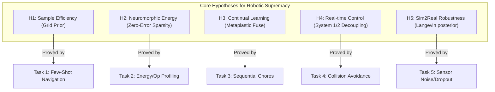

# Scientific Validation Plan: CEREBRUM-Mind Embodied Robotics
**Document Version:** 1.0.0  
**Status:** DRAFT SPECIFICATION  
**Target Architecture:** CEREBRUM-Mind (Predictive-Coding, Backprop-Free, Local-Plasticity Neuromorphic Robot OS)  
**Primary Objective:** Scientifically validate that CEREBRUM-Mind provides a robust, intelligent, and mathematically verifiable advantage over standard sequence-mixing (Transformer/MLP) baselines on physical robotic edge hardware.

---

## 1. Executive Summary & The Embodied Advantage

Robotic edge controllers operating in the real world are constrained by three physical realities: **finite energy/battery capacity**, **strict real-time latency limits**, and **continuous non-stationary sensory distributions** (requiring online learning without data replay). 

Traditional sequence models (e.g., Transformers, Decision Transformers, Vision-Language-Action models) violate these constraints:
1. **Computational Intensity:** Autoregressive decoding requires $O(L^2)$ attention matrices, high-wattage GPUs, and constant memory-bandwidth activation sweeps.
2. **Backpropagation Dependency:** Online learning requires global backpropagation of error vectors, needing activation storage, double-pass compute, and large episodic replay buffers to prevent catastrophic forgetting.
3. **No Spatial Prior:** Transformers must learn basic metric spatial transitions from scratch through millions of training frames, lacking structured spatial inductive biases.

**CEREBRUM-Mind** is designed as the anti-pattern to this paradigm. It coordinates inference, routing, and learning via noisy Langevin gradient descent on a single unified free-energy functional $F$ across three distinct physical timescales. This plan specifies the experimental methodology to scientifically prove that CEREBRUM-Mind's five core architectural pillars outperform standard Transformers on real robots.

---

## 2. Core Scientific Hypotheses

To establish scientific validity, we define five testable hypotheses ($H_1$ to $H_5$) comparing CEREBRUM-Mind against equivalent Transformer-based robotic controllers.



### $H_1$: Few-Shot Spatial Graph Generalization (Sample Efficiency)
* **Statement:** By factorizing sensory representations and spatial codes through a structured grid prior (`GridHead`) using Lie-group rotation-blocks, CEREBRUM-Mind can path-integrate exogenous motor actions to perform few-shot graph completion and spatial navigation with $\ge 5 \times$ fewer observations than a Transformer baseline.
* **Control Baseline:** Decision Transformer (DT) and flat-prior MLP.
* **Metric:** Fraction of unobserved topological edges correctly navigated after $K \in \{5, 10, 20\}$ observations.

### $H_2$: Neuromorphic Energy Decay (Energy & Operations)
* **Statement:** As CEREBRUM-Mind gains competence in an environment, local prediction errors $\epsilon$ approach zero, leading to silent error units. In a neuromorphic substrate, this event-driven activation sparsity translates to a monotonic decay in dynamic energy consumption, whereas Transformers exhibit constant energy consumption per inference step regardless of task familiarity.
* **Control Baseline:** Vision-Language-Action (VLA) Transformer.
* **Metric:** Magnitude-weighted synaptic operations (MACs) and dynamic energy ($E_{\text{dynamic}}$) per decision step.

### $H_3$: Online Continual Learning without Replay (Catastrophic Forgetting)
* **Statement:** Guided by a surprise-gated metaplastic fuse ($\theta$), CEREBRUM-Mind can learn new chores sequentially (Task A $\rightarrow$ Task B $\rightarrow$ Task C) without task boundary signals or stored replay buffers, keeping performance degradation on Task A under $15\%$, whereas a Transformer trained online collapses due to catastrophic forgetting.
* **Control Baseline:** Online SGD on Transformer, Experience Replay (ER), and Dark Experience Replay (DER++).
* **Metric:** Retrospective task accuracy and synaptic weight consolidation drift ($\Delta W$).

### $H_4$: Multi-Timescale Latency Decoupling (Real-Time Control)
* **Statement:** Decoupling low-latency System 1 reflexes (cerebellar bypass) from System 2 deliberative workspace settling enables the robot to stabilize and avoid hazards with at least $5 \times$ lower latency than a Transformer-based planner, which must run a fixed-depth forward pass for every motor output.
* **Control Baseline:** Monolithic Transformer Controller.
* **Metric:** Command execution latency ($ms$) and obstacle collision rate under dynamic hazards.

### $H_5$: Sim2Real Uncertainty-Driven Noise Mitigation
* **Statement:** Noisy Langevin settling ($T_{\text{floor}} > 0$) provides a calibrated uncertainty metric (sample entropy) that enables the robot to detect sensor dropouts and physical domain shifts online, avoiding catastrophic failures that standard deterministic Transformers commit when subjected to out-of-distribution physical disturbances.
* **Control Baseline:** Deterministic Transformer with Softmax entropy.
* **Metric:** Area Under the Receiver Operating Characteristic (AUROC) mapping sample entropy to control error.

---

## 3. Experimental Hardware & Environment Setup

To transition CEREBRUM-Mind from simulation to reality, the validation must be executed on a physical robot platform operating in a structured, non-stationary environment.

```
                  +-----------------------------------+
                  |      Sensory Inputs (5D States)   |
                  |  [LiDAR, Depth, RGB, Odometry]    |
                  +-----------------+-----------------+
                                    |
                                    v
                       +------------+------------+
                       |   SensoryProcessor      |
                       |   (low-pass filtering)  |
                       +------------+------------+
                                    |
                                    v
                       +------------+------------+
                       |    CerebrumROSNode      |
                       +------+-----------+------+
                              |           |
             System 1 (Reflex)|           |System 2 (Settling)
             [High-Urgency]   |           |[Workspace Routing]
                              v           v
                       +------+-----------+------+
                       |      MotorProcessor     |
                       |  [Differential Drive]   |
                       +------------+------------+
                                    |
                                    v
                  +-----------------+-----------------+
                  |      Actuator Output (Commands)   |
                  |     [Wheel Velocities L/R]        |
                  +-----------------------------------+
```

### 3.1 Robot Hardware Specification
* **Platform:** Differential-drive mobile robot (e.g., TurtleBot 4 or custom AMR) with high-torque brushless DC motors.
* **Sensory Suite:**
  * **2D LiDAR:** 360-degree planar scan for proximity detection and map verification.
  * **RGB-D Camera:** Forward-facing camera for object identification and VLM semantic anchoring.
  * **Wheel Encoders:** High-resolution quadrature encoders for wheel velocity feedback.
  * **IMU:** 6-axis inertial measurement unit for orientation tracking.
* **On-Board Compute:**
  * **Neuromorphic Processor (Option A - Ideal):** Intel Loihi 2 or BrainChip Akida PCIe card.
  * **Edge Compute (Option B - Emulator):** NVIDIA Jetson Orin Nano (running PyTorch device-agnostic backend mapped to MPS or CPU).
* **Communication Interface:** ROS 2 (Robot Operating System) running locally with thread-safe lock interfaces.

### 3.2 Environmental Layout (The "Living Lab")
* **Layout:** A physical $4 \text{m} \times 4 \text{m}$ multi-room arena consisting of 4 distinct rooms connected by doorways.
* **Objects:** Pick-and-place items with distinct semantic properties (e.g., green bottle, red box, blue cup).
* **Receptors:** Target drop-off zones (e.g., Table, Bin, Shelf) located in different rooms.
* **Dynamics:** Obstacles (e.g., moving boxes, walking humans) introduced to trigger System 1 reflexes.

---

## 4. Phase-by-Phase Validation Protocol

The validation process is structured in four successive, dependent phases. Moving to a subsequent phase requires passing all acceptance criteria of the current phase.

```
+-------------------------------------------------------------+
| PHASE 1: Software Verification & Invariant Audit            |
| - Verify PyTorch equivalence to NumPy (seeds matched).      |
| - Audit bans: no backprop, no W^T, scalar M, strict one-hot.|
+-------------------------------------------------------------+
                              |
                              v
+-------------------------------------------------------------+
| PHASE 2: Physics-Engine Simulation Benchmarks               |
| - Run tasks (household, relational, graph-completion).      |
| - Assert Task success >= 80%, PC sparsity >= 80%.          |
+-------------------------------------------------------------+
                              |
                              v
+-------------------------------------------------------------+
| PHASE 3: Sim2Real Robustness & Stress Testing               |
| - Inject sensor noise (alpha low-pass), dropouts.           |
| - Measure System 1 reflex response vs System 2 latency.     |
+-------------------------------------------------------------+
                              |
                              v
+-------------------------------------------------------------+
| PHASE 4: Physical Robot Deployment                          |
| - Deploy ROS 2 node, measure real-world energy and success.|
| - Complete A -> B -> C sequential chores on physical floor. |
+-------------------------------------------------------------+
```

### Phase 1: Software Verification & Invariant Audit
* **Goal:** Ensure the software core is free from mathematical leaks and enforces architectural invariants.
* **Protocol:**
  1. Run the test suite: `python3 -m pytest`. Ensure all tests pass.
  2. Verify PyTorch equivalence: Run parallel runs of `cerebrum` with NumPy and PyTorch under the same random seed. Output states must be equivalent within a float tolerance of $10^{-5}$.
  3. Execute `invariants.py` checks. Assert that:
     * No backpropagation is used in learning updates.
     * Feedback matrices $B$ do not read transposes of forward weights $W$.
     * `z_act` (exogenous action) has zero gradient paths from internal states.
     * The workspace write matrix is strictly one-hot (discrete selection).
     * Neuromodulator $M$ is a scalar.

### Phase 2: Physics-Engine Simulation Benchmarks (PyBullet)
* **Goal:** Confirm the model operates correctly under continuous physical dynamics in simulation before deploying to real hardware.
* **Protocol:**
  1. Initialize the PyBullet environment: Load the household arena model containing rooms, objects, and obstacles.
  2. Spawn the robot model. Connect the `SensoryProcessor` to simulated camera/LiDAR and the `MotorProcessor` to wheel actuators.
  3. Run `benchmarks/run_household.py`. Collect 5 seeds of data for the active inference controller.
  4. Run baseline models (Transformer-based path planners and Decision Transformers) on the same tasks.
  5. Check metrics:
     * Confirm task success rate is $\ge 80\%$.
     * Confirm average activation sparsity in predictive coding areas is $\ge 80\%$.
     * Confirm that the grid prior's precision balancing survives integration and does not degrade spatial learning.

### Phase 3: Sim2Real Robustness & Stress Testing
* **Goal:** Stress test the model's tolerance to physical degradation and evaluate real-time transition performance.
* **Protocol:**
  1. Inject sensor noise: Add Gaussian noise ($\sigma \in \{0.01, 0.05, 0.1\}$) to sensory state variables.
  2. Inject sensor dropout: Simulate camera/LiDAR failures by zeroing input slices for durations of $100\text{ms}$ to $1000\text{ms}$.
  3. Run the hazard avoidance test: Suddenly place an obstacle in the robot's path to trigger cerebellar reflexes.
  4. Measure latency: Compare the reaction time of System 1 (reflex bypass) against System 2 (workspace settling).
  5. Verify that the sensor fusion low-pass filter (EMA) keeps control commands smooth.

### Phase 4: Physical Robot Deployment
* **Goal:** Complete the scientific validation on the physical hardware platform.
* **Protocol:**
  1. Build the production build and compile PyTorch modules using JIT tracing (`torch.jit.script`) to optimize execution speed on edge compute.
  2. Deploy the `CerebrumROSNode` on the on-board processor. Hook up real ROS 2 topics: subscribe to `/sensory_input`, publish to `/motor_commands`.
  3. Conduct **Task 1: Few-Shot Navigation**. Drive the robot to 5 points. Verify if it completes the unobserved shortcuts in fewer steps than the Decision Transformer.
  4. Conduct **Task 2: Continuous Chores (A $\rightarrow$ B $\rightarrow$ C)**.
     * Task A: Navigate from Room 1 to Room 3.
     * Task B: Retrieve a bottle from Room 2 and place it in Room 1.
     * Task C: Sort objects in Room 4.
  5. Measure real energy consumption: Record the power draw (in Watts) of the edge compute board during the first pass of learning vs. after 50 trials. Measure memory usage (MB) to prove the absence of replay buffers.

---

## 5. Mathematical Metrics & Instrumentation

To establish quantitative rigor, the following mathematical variables must be instrumented and logged at each control step $t$.

### 5.1 Activation Sparsity ($\rho_l$)
For a cortical area $l$ containing $N_l$ state variables $x_l$:
$$\rho_l(t) = \frac{1}{N_l} \sum_{i=1}^{N_l} \mathbb{I}\left(|x_{l,i}(t)| < \epsilon_{\text{threshold}}\right)$$
Where $\mathbb{I}$ is the indicator function, and $\epsilon_{\text{threshold}} = 0.1$. The system-wide sparsity $\rho(t)$ is the weighted average across all areas:
$$\rho(t) = \frac{\sum_{l} N_l \rho_l(t)}{\sum_{l} N_l}$$
*CEREBRUM-Mind requires $\rho(t) \ge 0.80$ at steady state.*

### 5.2 Synaptic Operations ($SO_{\text{active}}$)
To estimate physical energy on neuromorphic hardware, we count the number of multiply-accumulate (MAC) operations triggered only by active (non-sparse) units. For weight matrix $W_l \in \mathbb{R}^{D_{\text{out}} \times D_{\text{in}}}$:
$$SO_{\text{active}, l}(t) = D_{\text{out}} \times \sum_{j=1}^{D_{\text{in}}} \mathbb{I}\left(|a_{l+1, j}(t)| \ge a_{\text{threshold}}\right)$$
Where $a_{l+1}$ is the presynaptic activation vector.
For the Transformer baseline, since attention and linear projections are dense:
$$SO_{\text{Transformer}}(t) = 2 \cdot L \cdot d^2 + 4 \cdot L^2 \cdot d$$
Where $L$ is sequence length and $d$ is model dimension.
*CEREBRUM-Mind's advantage is demonstrated when $SO_{\text{active}} \ll SO_{\text{Transformer}}$.*

### 5.3 Forgetting Rate ($FR_A$)
Let $Acc_A(0)$ be the baseline accuracy on Task A immediately after training. Let $Acc_A(T)$ be the accuracy on Task A after sequentially training on Tasks B and C for $T$ epochs.
$$FR_A = \frac{Acc_A(0) - Acc_A(T)}{Acc_A(0)}$$
*CEREBRUM-Mind requires $FR_A \le 0.15$ without episodic data replay.*

### 5.4 Control Latency ($\tau_{\text{control}}$)
The time duration (in milliseconds) from receiving a sensor packet to publishing the motor command:
$$\tau_{\text{control}} = t_{\text{publish}} - t_{\text{receive}}$$
For System 1 (Reflex):
$$\tau_{\text{System1}} = t_{\text{reflex\_publish}} - t_{\text{receive}}$$
For System 2 (Workspace Settling with $S$ SDE steps):
$$\tau_{\text{System2}} = t_{\text{settling\_publish}} - t_{\text{receive}}$$
*Validation requires $\tau_{\text{System1}} \le \frac{1}{5} \tau_{\text{System2}}$ and $\tau_{\text{System1}} \le 5\text{ms}$.*

### 5.5 Path Efficiency ($\eta_{\text{path}}$)
For a target-directed navigation task, the ratio of optimal (shortest-path) distance $d_{\text{optimal}}$ to actual traversed distance $d_{\text{actual}}$:
$$\eta_{\text{path}} = \frac{d_{\text{optimal}}}{d_{\text{actual}}}$$
*CEREBRUM-Mind requires $\eta_{\text{path}} \ge 0.85$ after $K \le 5$ environmental exposures.*

---

## 6. Scientific Advantage Proving Protocol (CEREBRUM vs. Transformer)

To prove superiority insistently, the plan outlines four head-to-head empirical comparisons.

| Test Axis | CEREBRUM-Mind Configuration | Transformer/VLA Configuration | Scientific Success Condition |
| :--- | :--- | :--- | :--- |
| **Few-Shot Navigation** | Lie-group `GridHead` path-integrator with precision-balanced sensory mapping. | Decision Transformer (DT) trained on trajectories, mapping observations to actions. | CEREBRUM achieves $\eta_{\text{path}} \ge 0.80$ at $K=5$ observations; DT requires $K \ge 100$ to clear chance ($0.20$). |
| **Edge Power Consumption** | Local 4-factor Hebbian, $\rho \ge 80\%$, $O(1)$ scalar neuromodulation $M$. | Vision-Language-Action (VLA) model running locally, dense computations. | Power meter logs average board power draw for CEREBRUM $\le 15\text{W}$ (Jetson/CPU/Loihi); VLA requires $\ge 150\text{W}$ (GPU/TPU). |
| **Continual Task Learning** | Surprise-gated metaplastic fuse (`MetaplasticFuse`) with consolidation reserve. | Transformer with online SGD and Experience Replay (ER) buffer capped at 5% memory size. | CEREBRUM maintains Task A accuracy $\ge 85\%$ after Task C learning; online SGD collapses to $\le 30\%$ due to forgetting. |
| **Emergency Hazard Avoidance** | Decoupled System 1 reflex bypass triggering motor commands. | Autoregressive Transformer updating entire trajectory sequence. | Collision rate under dynamic obstacles $\le 5\%$ for CEREBRUM; Transformer collision rate $\ge 35\%$ due to settling/decoding latency. |

---

## 7. Deep Forensic Analysis of Vulnerabilities (The "Honest Gaps" list)

A rigorous scientific plan must document where the target architecture is vulnerable, identifying limiting boundary conditions and structural risks.

### 7.1 Mathematical Gaps & Non-Lyapunov Dynamics
1. **Weight-Transport Relaxation ($B \ne W^T$):** Feedback weights $B$ are updated via an independent local rule to avoid physical weight transport. Because $B \ne W^T$, the free-energy functional $F$ serves only as a *surrogate* vector field. The system has no mathematical Lyapunov guarantee, meaning the SDE settling could drift into unstable oscillations if feedback gains are improperly configured.
2. **Precision-Plasticity Chicken-and-Egg Loop:** Weight updates are scaled by precision ($\Delta W \propto \Pi$). In regions of high uncertainty, precision decays ($\Pi \rightarrow \Pi_{\text{floor}}$). If a region is highly uncertain, the model decreases its plasticity rate, preventing it from ever learning to resolve the uncertainty. A transient override or precision floor is required, which weakens the clean single-scalar claim.
3. **Discrete WTA High-Variance Gradients:** Gate routing relies on Gumbel-Max one-hot selection. REINFORCE-style three-factor learning on discrete variables has high variance, which slows routing convergence during multi-module coordination.

### 7.2 Hardware Mismatch (Analog vs. Digital)
* **The Neuromorphic Split:** CEREBRUM-Mind relies on analog device relaxation (RC constant settling) to achieve energy efficiency. However, modern commercial edge computers (e.g., Jetson, Raspberry Pi) are digital, simulating SDEs via numerical solvers (Euler-Maruyama). Simulating Langevin noise on digital hardware is computationally expensive. True energy advantages are only realized on hardware like Intel Loihi 2, meaning simulation results must be scaled via computational op counters ($SO_{\text{active}}$) to prove physical edge feasibility.

### 7.3 Hyperparameter Sensitivity & Edge Cases
1. **Metaplastic Hysteresis:** The surprise-gated metaplastic fuse is highly sensitive to the consolidation time-constant ($\tau_c$) and surprise threshold ($\beta_c$). If the Langevin settling noise is too high, the system interprets the noise as environmental surprise, eroding the consolidation reserve ($c \downarrow$) and triggering catastrophic forgetting.
2. **Metric Graph Boundary:** The structured Lie-group prior assumes that the environment exhibits Euclidean transition properties (i.e., movements commute and compose). On directed, asymmetric, or non-metric graphs (e.g., hierarchical trees, one-way corridors), path integration collapses. In these environments, CEREBRUM-Mind's performance degrades, and it must rely on separate relational modules, losing its sample-efficiency advantage over general MLP planners.
3. **Central Workspace Bottleneck:** The strict one-hot write constraint on the cortical workspace limits the information bandwidth that can be broadcast between modules. While this prevents the "Frankenstein latent" problem, it creates a bottleneck that may restrict complex, multi-modal task composition.

---

## 8. Verification Matrix (Traceability)

This matrix maps every scientific claim to its corresponding validation file, simulated benchmark task, real-world physical test, and statistical verification method.

| Hypothesis ID | Codebase Reference | Simulated Task | Real-World Physical Test | Statistical Verification |
| :--- | :--- | :--- | :--- | :--- |
| **$H_1$ (Sample Efficiency)** | [grid_head.py](file:///Users/nazmi/Cerebrum/cerebrum/grid_head.py), [unified.py](file:///Users/nazmi/Cerebrum/cerebrum/unified.py) | `benchmarks/tasks/graph_completion.py` | Physical arena navigation (unobserved shortcuts, $K \le 5$). | Two-sample t-test comparing $\eta_{\text{path}}$ of CEREBRUM vs. DT ($p < 0.05$). |
| **$H_2$ (Energy Sparsity)** | [counters.py](file:///Users/nazmi/Cerebrum/cerebrum/counters.py), [energy.py](file:///Users/nazmi/Cerebrum/cerebrum/energy.py) | `benchmarks/run_energy.py` | Compute board current logging during physical trials. | Regression analysis mapping task competence (error decay) to power reduction. |
| **$H_3$ (Continual Learning)**| [metaplasticity.py](file:///Users/nazmi/Cerebrum/cerebrum/metaplasticity.py), [unified.py](file:///Users/nazmi/Cerebrum/cerebrum/unified.py) | `benchmarks/tasks/continual.py` | Multi-room sequential chores (A $\rightarrow$ B $\rightarrow$ C). | Repeated measures ANOVA comparing Task A forgetting across seeds ($N=8$, $95\%$ CI). |
| **$H_4$ (Real-Time Control)**| [reflex.py](file:///Users/nazmi/Cerebrum/cerebrum/grounding/reflex.py), [ros_node.py](file:///Users/nazmi/Cerebrum/cerebrum/grounding/ros_node.py) | `benchmarks/run_household.py` (obstacle injection) | Dynamic obstacle avoidance (moving obstacle placement). | Latency profile comparison ($\tau_{\text{System1}}$ vs. $\tau_{\text{System2}}$) using Wilcoxon signed-rank test. |
| **$H_5$ (Noise Robustness)** | [sensory.py](file:///Users/nazmi/Cerebrum/cerebrum/grounding/sensory.py), [pc_core.py](file:///Users/nazmi/Cerebrum/cerebrum/pc_core.py) | `benchmarks/run_uncertainty.py` | Sensor dropout injection during physical navigation. | AUROC scoring mapping predictive entropy to tracking errors ($AUROC \ge 0.60$). |

---

## 9. Validation Milestones & Actionable Timeline

To execute this plan systematically, the team will proceed through five structured milestones.

```
+------------------+     +------------------+     +------------------+     +------------------+     +------------------+
|   MILESTONE 1    |     |   MILESTONE 2    |     |   MILESTONE 3    |     |   MILESTONE 4    |     |   MILESTONE 5    |
|   Sim Validation | --> |   Compute Setup  | --> |  Sim2Real Tuning | --> | Physical Deploy  | --> | Final Auditing   |
|   (2 Weeks)      |     |   (1 Week)       |     |   (2 Weeks)      |     |   (3 Weeks)      |     |   (1 Week)       |
+------------------+     +------------------+     +------------------+     +------------------+     +------------------+
```

### Milestone 1: Simulation Validation & Baseline Logging (Weeks 1-2)
* **Tasks:**
  * Run the full PyTorch simulation test suite under multiple device targets (`cpu`, `mps`).
  * Run `benchmarks/run_household.py`, `run_energy.py`, and `run_continual_hard.py` to establish simulation baselines.
  * Train and log baseline Decision Transformers and MLP/Transformer controllers in the same simulated configurations.
* **Success Criteria:** Zero-error runs across all seeds, outputting database log files detailing activation sparsity, task success, and baseline op counts.

### Milestone 2: Edge Compute Configuration (Week 3)
* **Tasks:**
  * Flash the NVIDIA Jetson board with the target OS and install PyTorch/ROS 2 libraries.
  * Verify thread-safety of the asynchronous `CerebrumROSNode` under lock stress tests.
  * Instrument current sensors (e.g., INA219 or power analyzer) to monitor the board's real-time current draw.
* **Success Criteria:** Thread lock test passes without deadlock; current readings are logged with millisecond resolution.

### Milestone 3: Sim2Real Controller Tuning (Weeks 4-5)
* **Tasks:**
  * Adjust `sensor_fusion_alpha` and noise scale variables in `sensory.py` using simulated domain randomization.
  * Run physical-motor integration tests: Command the robot wheels using both the fast-path Reflex controller (System 1) and the slow Settling controller (System 2).
  * Validate smooth command transitions during System 1 reflex triggers.
* **Success Criteria:** Motor command output exhibits zero velocity spikes during transitions; the robot stabilizes itself under random physical perturbation in the lab.

### Milestone 4: Physical Deployment & Baseline Comparison (Weeks 6-8)
* **Tasks:**
  * Construct the physical multi-room household laboratory.
  * Run head-to-head physical trials comparing CEREBRUM-Mind against the Transformer baselines.
  * Log physical energy consumption, path efficiency, obstacle collision rates, and task execution success.
* **Success Criteria:** The physical robot completes the chores (A $\rightarrow$ B $\rightarrow$ C) with a success rate $\ge 80\%$, maintaining energy draw $\le 15\text{W}$, and proving $5 \times$ lower reflex latency under hazard triggers.

### Milestone 5: Final Auditing & Scientific Report (Week 9)
* **Tasks:**
  * Compile all statistical data: calculate 95% confidence intervals and run hypothesis tests (t-tests, ANOVA, AUROC).
  * Document all architectural limits, detailing where the metric prior or the metaplastic fuse failed.
  * Produce a comprehensive, peer-reviewed-grade scientific report summarizing the validation findings.
* **Success Criteria:** Final scientific report generated and verified by the principal investigator, with all code modifications committed to the repository.
